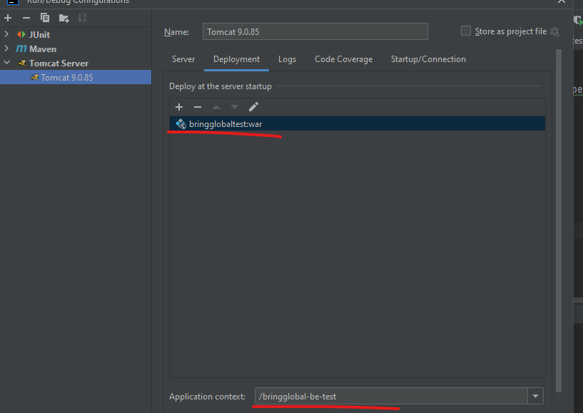
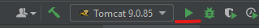

# Secure Spring WebMVC application using Spring Security

- Como o acesso ao endpoint que você me mandaram não estava funcionando, decidi pegar pelo menos 3 transações de teste
para pelo menos ter alguma coisa.

# Executar o server com os dados
1) utilizei o json-server
2) executei -> npx json-server dataAll.json --port 3001

# Executar a aplicação
1) Rodar -> mvn clean install
2) Criei um servidor tomcat pelo intelliJ

